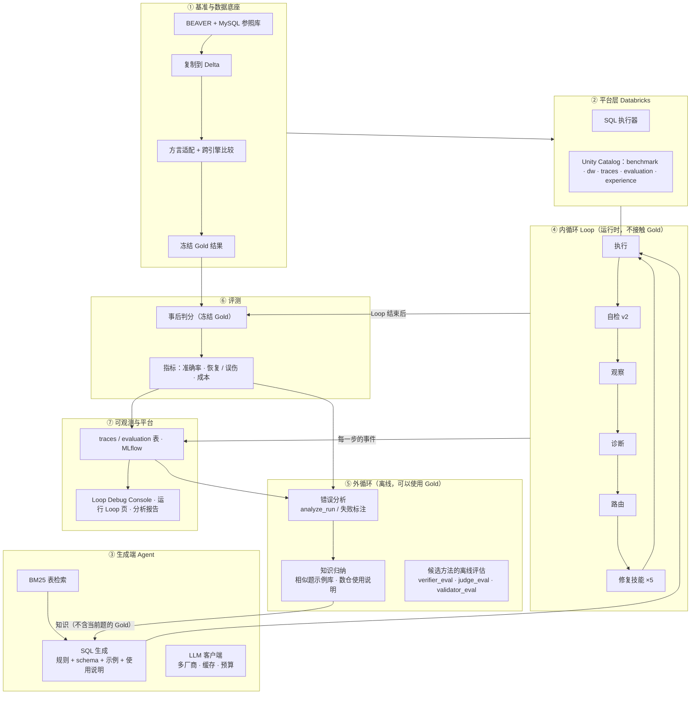

# 项目架构：整体框架与各模块的设计原理

> 本文回答两个问题：**项目由哪几部分组成**，以及**每部分为什么这样设计、内部逻辑是什么**。
> 运行一次项目要经过哪些步骤、各步执行哪段代码，见 [RUN_FLOW.md](RUN_FLOW.md)；Loop 内部逐步讲解见 [LOOP_WALKTHROUGH.md](LOOP_WALKTHROUGH.md)；所有数字的出处见 [EXECUTION_LOG.md](EXECUTION_LOG.md)。
> 每一部分的深度拆解（模块设计原理、代码实现、数据流转，附代码行号）见 [deep_dive/00_总览.md](deep_dive/00_总览.md)。
> 每次调用 LLM 时模型看到什么、为什么、由哪段代码拼出、实测 token 构成，见 [CONTEXT_DESIGN.md](CONTEXT_DESIGN.md)。
> Loop 的模块、类关系、时序图和数据流，见 [LOOP_ARCHITECTURE.md](LOOP_ARCHITECTURE.md)。
> 内容以 2026-09-29 的代码为准。

---

## 1. 一句话定位

**一个带"双循环"的 Text-to-SQL Agent**：
- **内循环**在运行时自己发现失败、诊断原因、选技能修复；
- **外循环**离线从已解题和错误中归纳数仓知识，交给生成端使用。

本项目中Text-to-SQL 是载体，主要展示的是 **Loop Engineering**：怎么设计闭环、怎么度量闭环、怎么用数据决定闭环里放什么。

| 项 | 选择 |
|---|---|
| 基准 | BEAVER dw 库（97 张表、5,787 道题）；评测集 89 题、开发集 30 题 |
| 平台 | Databricks：Unity Catalog、SQL Warehouse、Delta、MLflow、Databricks Apps |
| 模型 | 默认智谱 glm-4-flash（免费）；DeepSeek deepseek-flash（付费） 可切换

---

## 2. 总体框架



纯文本版（适合白板手画）：

```
                 ┌──────────── ⑤ 外循环（离线，可用 Gold）────────────┐
                 │ 错误分析 → 归纳知识（相似题示例、数仓使用说明）       │
                 │ 候选自检方法的离线评估（抓错率 / 误报率）              │
                 └──────────────┬───────────────────────▲─────────────┘
                     知识（运行时只读）│                    │ trace + 判分
┌──── ③ 生成端 ────────────────────▼──┐   ┌───────────────┴─────────────┐
│ 检索表 → 生成 SQL（规则+schema+示例+说明）│──▶│ ④ 内循环：执行→自检→观察→诊断  │
└─────────────────────────────────────┘   │           →路由→修复→再执行    │
                                          └───────┬───────────────────────┘
                                                  │ Loop 结束后
                                   ⑥ 评测：冻结 Gold 判分 → 指标
                                   ⑦ 可观测：traces / MLflow / Console / 运行页
          ② 平台层：Databricks SQL Warehouse · Unity Catalog · Delta
          ① 基准底座：BEAVER → MySQL 参照 → 复制 → 适配 → 冻结 Gold
横切：Gold 隔离 · 训练 / 开发 / 评测集纪律 · 可复现 · 成本控制 · 安全
```

产品化之后多了一个入口和一个审批环节（详见第 8.1 节）：用户在**提问页**提问，只走内循环；👍 / 👎 反馈和训练集错题一起喂给外循环；外循环的提案在开发集上过回归门禁后，由数据工程师在**审核页**批准才上线，可随时停用回滚。

**两条最重要的边界**：
1. **Gold 只出现在三个地方**：底座（冻结 Gold）、评测（Loop 结束后判分）、外循环（离线学习，而且只用训练集）。生成端和内循环在代码层面拿不到当前题的 Gold。
2. **三份数据各有用途**：训练集（评测集和开发集以外的约 5,650 道已解题）用来**学习**；开发集（30 题）用来**衡量改动**；评测集（89 题）等配置冻结后只跑一次。

---

## 3. 目录与模块对应

| 部分 | 目录 / 文件 | 对应阶段 |
|---|---|---|
| ① 基准底座 | `benchmark/beaver/`、`scripts/phase0.py`、`scripts/fetch_beaver_db.py`、`config/phase0.yaml` | Phase 0 |
| ② 平台层 | `execution/`、`dbx/` | 贯穿全程 |
| ③ 生成端 | `agent/`（retriever、generator、examples、knowledge、llm、join_graph、sql_analysis） | Phase 1 起 |
| ④ 内循环 | `loop_engineer/`（controller、verifier、checks、observer、diagnose、policy）、`skills/` | Phase 4–6 |
| ⑤ 外循环 | `scripts/analyze_run.py`、`scripts/build_knowledge.py`、`scripts/*_eval.py`、`loop_engineer/judge.py`、`loop_engineer/validators.py` | 优化阶段 |
| ⑥ 评测 | `benchmark/beaver/evaluator.py`、`benchmark/beaver/subtasks.py`、`evaluation/` | Phase 1/3/4/6 |
| ⑦ 可观测与平台 | `dbx/publish.py`、`app/`、`app.yaml`、`scripts/publish_run.py`、`scripts/build_app_bundle.py`、`scripts/deploy_app.py` | Phase 9 |
| 配置 | `config/phase0.yaml`、`config/phase1.yaml`、`.env`（不入库） | — |
| 测试 | `tests/`（165 个） | — |

---

## 4. ① 基准与数据底座（Phase 0）

**要解决的问题**：BEAVER 的官方引擎是 MySQL，项目跑在 Databricks 上。换了引擎，标准答案还成不成立？没有这一步，后面所有准确率都没有可信度。

**逻辑**

```
下载 BEAVER（HF 门控数据集，学员自己申请访问）→ MySQL 还原（参照库）
→ 97 张表复制到 Delta（逐表核对行数和列画像）
→ 每道题的 Gold SQL 在两个引擎上各跑一次，比较结果
→ 不一致的，查明原因，加有文档记录、经过结果验证的适配规则
→ 通过的题把 Gold 结果冻结到 benchmark.gold_results
```

| 模块 | 设计原理 |
|---|---|
| `replicate.py` 复制 | 按列映射类型；MySQL 的 `_ci`（不区分大小写）排序规则映射为 Databricks 的 `UTF8_LCASE`，保证字符串比较行为一致 |
| `compatibility.py` 兼容性 | 同一条 Gold SQL 在两个引擎上重复执行，对错误分类，识别结果不稳定的题 |
| `adapter.py` 适配 | **只加两条规则、不改原始 Gold**：`VARIANCE/STD/STDDEV → VAR_POP/STDDEV_POP`（MySQL 这几个函数是总体统计）；非聚合窗口函数去掉 frame 子句。改写后的 SQL 另存，原文保留 |
| `evaluator.py` 比较 | 官方口径：按结果集比较，不比 SQL 文本，列顺序算数。跨引擎比较只放宽数值表示差异：DECIMAL 按各自精度比较，浮点相对误差 1e-6，大结果集分桶匹配 |
| 冻结 Gold | 之后的判分只读冻结的结果，不依赖 MySQL，可复现，也不会因为重新计算而悄悄变化 |

**主要函数的功能**

| 函数 | 位置 | 功能 |
|---|---|---|
| `map_column` | `benchmark/beaver/replicate.py` | 把一个 MySQL 列映射成 Databricks 列：确定目标类型，`_ci` 排序规则映射为 `UTF8_LCASE` |
| `write_parquet` / `insert_from_parquet_sql` | `benchmark/beaver/replicate.py` | 把 MySQL 表数据按列映射写成 parquet，再生成从 staging volume 导入 Delta 的 SQL |
| `profile_sql` / `compare_profiles` | `benchmark/beaver/replicate.py` | 在两个引擎上各算一份列画像并逐列比较，核对复制是否忠实 |
| `run_repeated` | `benchmark/beaver/compatibility.py` | 同一条 SQL 在一个引擎上重复执行多次，判断结果是否稳定 |
| `classify_error` / `static_hazards` | `benchmark/beaver/compatibility.py` | 把执行报错归入几类兼容性问题；从 SQL 文本中静态找出可能导致结果不稳定的写法 |
| `validate_case` | `benchmark/beaver/compatibility.py` | 对一道题：Gold SQL 在 MySQL 和 Databricks 上各跑一遍，比较结果，产出兼容性记录 |
| `apply_rules` / `try_adapt` | `benchmark/beaver/adapter.py` | `apply_rules` 对 Gold SQL 应用两条适配规则，返回改写后的 SQL；`try_adapt` 对不一致的题尝试适配，并验证改写后的结果与 MySQL 一致 |
| `official_match` | `benchmark/beaver/evaluator.py` | BEAVER 官方口径：按结果集比较，不比 SQL 文本 |
| `cross_engine_match` | `benchmark/beaver/evaluator.py` | 跨引擎比较两份结果，只放宽数值表示差异（DECIMAL 精度、浮点相对误差） |
| `evaluate_against_gold` | `benchmark/beaver/evaluator.py` | 拿生成 SQL 的结果和冻结的 Gold 结果比较，返回是否答对和原因 |

**结果**：严格比较只有 37/100 一致，查出三类方言差异（数值的表示精度不同、统计函数的口径不同、排名类窗口函数上的 frame 子句）后补上两条规则（规则一：VARIANCE/STD/STDDEV → VAR_POP/STDDEV_POP；规则二：删掉 frame 子句），**最终 89 道可用**（原样 46 + 适配 43）。

---

## 5. ② 平台层（Databricks）

| 模块 | 做什么 | 设计原理 |
|---|---|---|
| `execution/databricks_sql.py` | 连接 SQL Warehouse、执行、返回统一的 `ExecutionResult` | **只允许单条只读语句**；会话设置统一（ANSI 关、超时 120 秒、关结果缓存）；结果超过 50 万行返回 `TOO_MANY_ROWS`，防止笛卡尔积；报错时抽出错误类别，比如 `UNRESOLVED_COLUMN` |
| `execution/mysql.py` | MySQL 参照引擎 | 和 Databricks 执行器接口相同，两个引擎可以互换比较 |
| `dbx/catalog.py` | Catalog 布局、写 Delta | 一个 catalog、5 个 schema，按**权限边界**划分：`benchmark`（Gold）、`dw`（数仓表）、`traces`（Agent 可见）、`evaluation`（判分结果）、`experience`（知识库，预留）；先写 parquet 到 staging volume，再 `INSERT ... BY NAME` |
| `dbx/tables.py` | 所有 Delta 表的 Arrow schema | 字段定义只在一个地方维护 |

**主要函数的功能**

| 函数 | 位置 | 功能 |
|---|---|---|
| `DatabricksSqlExecutor.execute` | `execution/databricks_sql.py` | 只读检查后执行一条 SQL，返回统一的 `ExecutionResult`（状态、结果行、报错、错误类别、耗时）；超过行数上限返回 `TOO_MANY_ROWS` |
| `extract_error_class` | `execution/databricks_sql.py` | 从 Databricks 报错文本中抽出错误类别，如 `UNRESOLVED_COLUMN` |
| `MySqlExecutor.execute` / `iter_table` | `execution/mysql.py` | 在 MySQL 参照库上执行 SQL（接口与 Databricks 执行器相同）；按批读取整张表，供复制使用 |
| `ensure_layout` | `dbx/catalog.py` | 确保项目 catalog 和 5 个 schema 存在，返回布局对象 `Layout` |
| `write_rows` | `dbx/catalog.py` | 把一批记录按 Arrow schema 转成 parquet，上传到 staging volume，再 `INSERT ... BY NAME` 写入 Delta 表 |

**设计要点**：
- **执行器是 Loop 的"传感器"**：Databricks 的报错是结构化的，包括错误类别、找不到的列、"Did you mean" 候选。这是后面规则诊断不需要调用 LLM 的前提。
- **`traces` 和 `evaluation` 物理上分开**：从存储层面保证"Agent 能读的"和"判分用的"不混在一起，避免测试结果虚高。

---

## 6. ③ 生成端 Agent

**要解决的问题**：给一道自然语言问题，从 97 张表的数仓里生成一条正确的 SQL。

**逻辑**

```
问题 → BM25 检索 20 张候选表 →（可选）相似题示例：检索 4 道已解题，并把它们用到的表补进 schema
     →（可选）数仓使用说明：本题相关的用表约定和关联约定
     <font color="red">→ prompt = 规则 + schema + 示例 + 使用说明 + 问题 → LLM → 抽取 SQL</font>
```

| 模块 | 设计原理 |
|---|---|
| `retriever.py` BM25 检索 | 文档由表名、列名、样例值组成，权重 3/2/1；k=20 是在评测集以外的题上调出来的拐点（召回 0.91）。**确定性**：分数相同时按表名排序 |
| `generator.py` 生成 | prompt 规则里写明这个数仓的**通用约定**（方言、字符串不区分大小写、统计函数对应），但不包含任何具体题目的信息。三种模式：`baseline-v2`（固定 3 个示例）、`baseline-v3-dynfs`（相似题示例）、`+kb`（加数仓使用说明） |
| `examples.py` 相似题示例 | 示例库 = 训练集已解题（**排除评测集和开发集**，5,508 道），按问题文本做 BM25；示例用到的表补进 schema（最多 6 张）。原理：同类问题在这个数仓里用哪些表、怎么关联，用已解题直接示范 |
| `knowledge.py` 数仓使用说明 | 从训练集统计三类约定：概念 → 常用表（IDF 加权）、相似表组（列名相似度 ≥ 0.5）在同类问题里的使用比例、每对表常用的关联键和 INNER / LEFT 比例。每题只取相关的 7–13 行（开发集实测，多数 12–13 行） |
| `llm.py` LLM 客户端 | 一个 OpenAI 兼容客户端，按配置切换智谱和 DeepSeek。**贪心解码 + prompt 指纹缓存**：同一个 prompt 永远拿到同一个回答，同一配置重跑时结果逐字相同，实验可复现，也省钱。`UsageMeter` 限制调用次数和 token；key 只从 `.env` 或 secret 读取 |
| `join_graph.py`、`sql_analysis.py` | 从 schema 推断候选关联键；用 sqlglot 解析 SQL，把别名还原成真实表名。供诊断和修复技能使用 |

**主要函数的功能**

| 函数 | 位置 | 功能 |
|---|---|---|
| `BM25TableRetriever.retrieve` | `agent/retriever.py` | 用 BM25 按问题文本给 97 张表打分，返回最相关的前 20 张候选表及分数 |
| `FewShotGenerator.generate` | `agent/generator.py` | 挑选示例，补充示例和审核知识里用到的表，拼出 prompt 调用 LLM，从回复中抽取 SQL |
| `ExampleIndex.build` / `top` | `agent/examples.py` | `build` 用训练集已解题建示例库（排除评测集和开发集）；`top` 按问题文本取最相似的 k 道题 |
| `WarehouseKnowledge.build` / `notes_for` | `agent/knowledge.py` | `build` 从训练集统计用表约定、相似表组和关联约定；`notes_for` 为一道题挑出相关的几行说明写进 prompt |
| `make_client` | `agent/llm.py` | 按模型名创建 OpenAI 兼容客户端（智谱或 DeepSeek），挂上调用预算 `UsageMeter` |
| `CachingChatClient.complete` | `agent/llm.py` | 所有 LLM 调用的入口：按 prompt 指纹查缓存，命中就重放，未命中才真正调用 |
| `join_candidates` / `connect` | `agent/join_graph.py` | 只根据 schema 推断关联键：列出一组表之间的候选关联；找出一张新表接到已用表上的方式 |
| `sql_facts` / `alias_map` | `agent/sql_analysis.py` | 解析 SQL 语法树：`sql_facts` 提取用了哪些表、列、关联、运算；`alias_map` 给出“别名 → 表名”对应关系 |

**数据**（开发集 30 题，只生成一次、不修复）：

| 模型 / 模式 | 固定示例 | 相似题示例 | 相似题示例 + 使用说明 |
|---|---|---|---|
| glm-4-flash 答对 / 能执行 | 0 / 4 | 3 / 16 | **5** / 16 |
| deepseek-flash 答对 | 3 | — | — |

**设计要点**：错误分析显示，能执行但答错的主要原因是**在相似表之间选错了**（漏用的表 34/41 其实已经检索到）。所以生成端的改进方向是"告诉模型这个数仓的习惯"，而不是检索更多的表。

---

## 7. ④ 内循环 Loop（运行时）

**要解决的问题**：第一次生成失败时，Loop 在**不看标准答案**的前提下，自己发现失败、判断原因、有针对性地修复。

**逻辑**

```
执行 → 自检 ─通过→ 结束
          └未通过→ 观察（白名单）→ 诊断（规则优先）→ 路由（查表）→ 技能修复 → 回到执行
最多 (最大修复次数 + 1) 次尝试；最终答案 = 最后一次自检通过的 > 最后一次能执行的 > 最后一次
```

| 模块 | 输入 → 输出 | 设计原理 |
|---|---|---|
| `controller.py` LoopController | 题面 → 所有尝试 + 最终答案 | **控制器只负责顺序编排、终止和记录**，检索、诊断、修复等能力都在组件里，构造时注入；每次尝试的过程写进尝试记录（即 trace）；每一步发出事件（`on_event`），只通知、不影响 Loop |
| `verifier.py` + `checks.py` 自检 v2 | 尝试 + SQL在DataBricks上的执行结果 → 通过 / 未通过 + 信号 | **只用生产环境拿得到的信号**。三层：显式失败（报错、空结果等）、4 条结构规则（关联条件恒为真、JOIN 缺条件、缺少分组、四舍五入）、6 条数值一致性规则（由**代码**核对，不用 LLM 推理）。**只有离线评估中误报接近 0 的信号才能触发修复**，其余只作提示。"通过"只表示没发现问题，不代表答案正确 |
| `observer.py` 观察 | 尝试记录 → 结构化信号 | **白名单**：只放行 12 个 Agent 可见的字段（OBSERVABLE_FIELDS），Gold 相关字段天然进不来；从报错中解析出错误类别、找不到的列、候选列、缺失的表 |
| `diagnose.py` 诊断 | 信号 + schema → 失败类型、置信度、证据 | **规则优先**：报错里已有答案时只做一次 schema 查找（列在已用的表里 → 挂错别名；在检索到但没用的表里 → 选表……）；自检发现的语义问题按映射表归类；只有 SQL 能跑但结果可疑时才调用 LLM。`repair_hints` 把证据原样传给技能 |
| `policy.py` 路由 | 失败类型 → 技能 | **映射写成数据**：消融只需换表或禁用技能，不改代码；兜底路由会记录在 trace 里 |
| `skills/` 修复技能 | 观察 + 诊断 + 修复上下文 → 新 SQL + 修复过程记录 | 5 个技能实现同一个接口 `repair(观察, 诊断, 上下文)`，由路由按失败类型选择。每个技能分两步：**① 先做不需要 LLM 的工作**：根据诊断给出的证据整理定向信息，能确定性修好的直接修好、不再调 LLM（如 SchemaSearch 按表结构把挂错别名的列改到正确的表，并检查改完后关联条件不会变成 `x = x`）；**② 需要时再调一次 LLM 改写 SQL**：所有技能共用一个修复模板（规则 + schema + 问题 + 上次的 SQL + 报错或自检发现 + 诊断），区别只在各自写的**定向指令**和**给出的表**。技能不执行 SQL，新 SQL 由控制器在下一轮执行和自检；`details` 记录技能内部的每个决定（确定性修改、候选列、候选关联键、给 LLM 的指令和 prompt），供网页展示；技能不能导入 benchmark / evaluation（测试强制），拿不到标准答案 |

**主要函数的功能**

| 函数 | 位置 | 功能 |
|---|---|---|
| `LoopController.run` | `loop_engineer/controller.py` | 编排一道题的闭环：检索 → 生成 → 循环（执行 → 自检 → 观察 → 诊断 → 路由 → 修复）→ 选出最终答案，返回所有尝试和最终答案 |
| `LoopController._execute` | `loop_engineer/controller.py` | 执行一条 SQL，返回并入尝试记录的执行摘要和单独保存的完整结果行 |
| `SelfVerifier.verify` | `loop_engineer/verifier.py` | 不看 Gold，根据执行状态、SQL 结构和结果数值判断这次尝试是否可疑，返回是否通过、触发的信号和修复提示 |
| `check_static` / `check_numeric` | `loop_engineer/checks.py` | `check_static` 解析 SQL、对照题干做结构检查；`check_numeric` 把输出列对应到统计函数，用代码核对数值是否自相矛盾 |
| `observe` | `loop_engineer/observer.py` | 按白名单从尝试记录中取 12 个可见字段，并从报错文本解析出错误类别、找不到的列、候选列、缺失的表 |
| `diagnose_by_rules` / `Diagnoser.diagnose` | `loop_engineer/diagnose.py` | 判断失败类型，给出置信度、原因和修复线索 `repair_hints`；先用规则，规则没有结论才调 LLM |
| `Policy.route` / `Policy.skill` | `loop_engineer/policy.py` | `route` 按“失败类型 → 技能”映射表选出技能名（被禁用的退回 RepairSQL）；`skill` 按名字取出技能对象 |
| `repair`（5 个技能） | `skills/*.py` | 修复一类失败：先做不需要 LLM 的确定性工作，解决不了的部分再带定向指令调用一次 LLM，返回新 SQL 和修复过程 |
| `fix_column_refs` | `skills/schema_search.py` | SchemaSearch 的确定性部分：把挂错别名的列改到同一作用域里唯一拥有它的表，并撤回会让关联条件变成 `x = x` 的改动 |
| `llm_repair` | `skills/base.py` | 用统一的修复模板（规则 + schema + 问题 + 上次 SQL + 报错或自检发现 + 诊断 + 定向指令）调用 LLM，并抽取新 SQL |

#### 从自检信号到修复：信号 → 失败类型 → 技能

一次尝试被自检拦下后，诊断根据**拦截的信号**和报错细节判断失败类型，路由按失败类型选技能：

| 自检信号 | 诊断依据 | 失败类型 | 技能 |
|---|---|---|---|
| `no_sql` ：没写出 SQL | 解析状态 | 执行错误 | RepairSQL |
| `execution_error`：列找不到 | 查这一列属于哪张表 → 属于 SQL **已用**的表（别名挂错） | 列映射 | SchemaSearch |
| | → 属于 SQL **没用**的表（检索到了或没检索到） | 选表 | RetrieveAgain |
| | → **哪张表都没有**（编造的列名） | 列映射 | SchemaSearch |
| `execution_error`：表不存在 | 错误类别 `TABLE_OR_VIEW_NOT_FOUND` | 选表 | RetrieveAgain |
| `execution_error`：其他报错（语法、聚合、类型、窗口用法……） | 错误类别 | 执行错误 | RepairSQL |
| `too_many_rows` 结果超过 50 万行 | 执行状态（行数爆炸多半是关联写错） | 关联键 | FindJoinPath |
| `join_tautology` 关联条件恒为真、`join_without_condition` JOIN 无条件 | 自检发现（映射表） | 关联键 | FindJoinPath |
| `missing_grouping` 问"每个"却没分组 | 自检发现 | 查询拆解 | ReplanQuery |
| 数值矛盾：平均值不在最小最大之间、最小值大于最大值、方差与标准差不符、标准差超过极差 | 自检发现 | 查询拆解 | ReplanQuery |
| `rounding` 四舍五入要求不符；统计量为负；计数不是整数 | 自检发现 | 执行错误 | RepairSQL |
| `empty_result` 结果为空、`all_null_column` 某列全空（以及超时、被拒绝执行） | 没有规则证据 → **LLM 诊断** | 6 类之一（解析失败为"未知"） | 按失败类型选（未知 → RepairSQL） |

路由表（`policy.py`）：选表 → RetrieveAgain；列映射 → SchemaSearch；关联键 → FindJoinPath；查询拆解 → ReplanQuery；执行错误、未知 → RepairSQL；**领域知识 → ReplanQuery（临时替代）**：预留的 RetrieveKnowledge 还没有不依赖标准答案的知识来源，trace 中标记为 fallback。被禁用的技能（消融实验）一律退回 RepairSQL。

**5 个技能各自怎么修**：

| 技能 | ① 不调 LLM 的部分 | ② 给 LLM 的定向指令和证据 |
|---|---|---|
| **SchemaSearch**（列映射） | 逐个检查 SQL 里带别名的列：列不在别名对应的表里、但同一作用域只有一张表有它，就改到那张表的别名；改完检查关联条件，若两边变成同一张表（`x = x`）就撤销。**全部改好则不调 LLM** | 改不了的列引用 + 数据库给的候选列 + 名字相近的列；涉及关联条件时，附上表之间共享的键列（≤ 10 条） |
| **RetrieveAgain**（选表） | 列找不到：取拥有这一列的表（≤ 4 张）加进 schema，并从表结构推断它们与已用表的关联键（≤ 8 条）；表不存在：找名字相近的真实表（≤ 4 张） | "这一列在这些表里，关联合适的那张"；或"这张表不存在，可用的相近表是……" |
| **FindJoinPath**（关联键） | 列出 SQL 已用各表之间共享的键列（≤ 12 条） | "关联条件可能有误，逐个核对 JOIN ON，只按匹配的键关联；会重复计数时先聚合再关联" |
| **ReplanQuery**（查询拆解） | 无 | "把问题拆成子问题，每个写成一个 CTE，再逐项核对输出列、过滤、分组、排序" |
| **RepairSQL**（执行错误、兜底） | 无 | "用最小改动修好报错" + Databricks 语法限制说明（子句顺序、窗口函数不能 DISTINCT、排名函数不能带 frame、统计函数用 `_POP` 等） |

调 LLM 时给出的 schema = SQL 已用的表 + 技能补充的表 + 检索到的表，最多 24 张；修复 prompt 里会写明报错原文，或自检发现的问题及修改提示。

**数据**：
- 修复后，30道开发集上测试，deepseek-flash模型上可答对题目由27→29，答案正确的题目由8→9

**设计要点**：内循环擅长兜住**显式失败**。"能执行但语义错"在这个基准上大部分无法靠自检可靠发现，见 §8，所以它的定位是"兜底"，不是"提升准确率的主力"。

---

## 8. ⑤ 外循环（离线学习与方法评估）

**要解决的问题**：内循环修不了"能执行但答错"。答错的根源是**不知道这个数仓的约定**，这些约定只能从已解题中学。同时，任何想加进 Loop 的方法，都要先证明有效。

**逻辑**

```
跑一批题（开发集只用于衡量）→ analyze_run 逐题对照 Gold 找错因、分类
→ 从训练集归纳通用知识（不看开发集错题的答案）：相似题示例库、数仓使用说明
→ 知识交给生成端 → 回到开发集衡量效果 → 有效才保留
```

| 模块 | 设计原理 |
|---|---|
| `scripts/analyze_run.py` 错误分析 | 拉取一次运行的 trace，最终答案和 Gold 逐项对照：用表、列、关联键、字面值、统计运算、行数、列数；输出主因分布，用来决定下一步补哪类知识 |
| `agent/examples.py`、`agent/knowledge.py` 知识资产 | **只从训练集归纳，运行时只读**；学到的是通用规律（比如"研究生信息在哪张表"），而不是"第 N 题的答案" |
| `scripts/verifier_eval.py`、`judge_eval.py`、`validator_eval.py` 方法评估 | 每个候选自检方法都测**抓错率**（在能执行但答错的尝试上）和**误报率**（在正确答案和 Gold SQL 上），数据决定"触发修复 / 只作提示 / 不用" |
| `loop_engineer/judge.py`、`validators.py` | LLM 裁判、查数据库的验证器（过滤值存在性、关联放大）。已经评估过，代码保留，目前只作提示 |

**主要函数的功能**

| 函数 | 位置 | 功能 |
|---|---|---|
| `main` | `scripts/analyze_run.py` | 拉取一次运行的结果，最终答案和 Gold 逐题对照（用表、列、关联键、字面值、统计运算、行数、列数），输出主因分布 |
| `LlmJudge.judge` | `loop_engineer/judge.py` | 让 LLM 判断“这条 SQL 和结果是否回答了问题”，返回判断、置信度和理由 |
| `ValidatorAgent.validate` | `loop_engineer/validators.py` | 查数据库做两项验证：过滤用的字面值在列里是否存在（`filter_values`）、关联是否让行数异常放大（`join_fanout`） |

**为什么不能把开发集错题的原因直接交给 Loop**：错因是拿 Gold 比出来的。交给 Loop 等于看答案改考卷，生产环境做不到，开发集也会失去衡量作用。正确的做法是**从训练集学通用知识、在开发集上衡量**。

**数据**（四轮自检实验的结论，以及错误分类）：

| 自检方法 | 抓到错题 | 误伤正确答案 | 结论 |
|---|---|---|---|
| 对照题干的规则 | 安全的规则抓不到，能抓的误报高 | — | 只接入安全规则 |
| LLM 裁判（glm / deepseek） | 10/30、27/30 | 4/33、**31/33** | 不接入：BEAVER 的题干和 Gold 本身常不一致 |
| 数值一致性 | 0/22 | 0/378 | 接入：零误报 |
| 查数据库的验证器 | 0/30、5/30 | 0/33、7/33（Gold 抽样 22%） | 只作提示 |

错误分类（deepseek + 相似题示例 + Loop，21 道能执行但错）：
- 选错表 38%、关联方式 19%，这两类（57%）可以从已解题中学习；
- 查询结构 19%、过滤理解 10%；
- 基准噪声 14%，无法消除。

**设计要点**：**分清信号能学什么**。
- 执行反馈（报错 → 修复后能运行）只能学"可执行性"知识，比如列属于哪张表、方言规则；修复后能运行的 SQL 不能当作正确示例。
- 语义知识需要 Gold 或人工标注，只在训练集上学。

### 8.1 产品化闭环：提问 → 反馈 → 外循环提案 → 回归门禁 → 人工审核 → 上线

按公司落地方式组织：用户问题没有真值，只走内循环；外循环离线运行，提出的改动**不直接生效**，要过开发集回归门禁，再由数据工程师批准。

```
用户（提问页）──问题──▶ 内循环（检索→生成→执行→自检→修复）──答案──▶ 用户 👍 / 👎（+ 修正 SQL）
        │                                                                     │
        └── experience.user_queries（问题 + 各次尝试）      experience.feedback（弱标签，不是 Gold）
                                                                              │
外循环 scripts/outer_loop.py（离线，一次迭代）◀──────────────────────────────────┘
  ① 抽训练集题 → ② 用当前系统生成、对照 Gold 判分并标注错因
  ③ 归纳候选：选表偏好（错用了相似表）、补表提示（漏掉的表）、关联规则（漏掉的关联键）、已验证查询（👍 答案 / 能执行的修正 SQL）
  ④ 逐条回归：在从训练集另留的验证集上，当前系统 vs 当前系统 + 这一条（答对不减少、零误伤、token 增幅 ≤ 20%）；
     prompt 没变的题直接复用结果；建议批准的再合在一起复核，并在开发集上复核
  ⑤ 写入 experience.proposals（pending）
        │
审核页（数据工程师）── 批准 ──▶ experience.knowledge_items（active）── 下一次提问即生效
                  └─ 驳回 / 停用（回滚）──▶ 状态改为 rejected / inactive，不删除，可追溯
```

| 模块 | 设计原理 |
|---|---|
| `app/app_pages/ask.py` + `app/runner.py` `AskRun` | 用户提问页：同一套 `build_controller` 组装内循环，只用 SelfVerifier（没有 Gold）；问题、最终 SQL、每次尝试写入 `experience.user_queries`；点赞 / 点踩、原因、修正 SQL（先只读执行校验）写入 `experience.feedback` |
| `evaluation/outer_loop.py` + `scripts/outer_loop.py` | 外循环一次迭代：从错题归纳候选知识，每条附证据（支持度、错题 id、错误 SQL）；关键词只保留在多道错题中出现、且确实指向该表的内容词（去掉数字和泛词）；每条单独在开发集上回归并给出建议（批准 / 中性 / 驳回），建议批准的再合用复核。评测集不碰 |
| `dbx/experience.py` | 提案和知识条目的读写。批准 = 更新提案状态 + 插入一条 active 知识；停用 = 状态改 inactive。**只改状态、不删数据**，谁在何时批准 / 停用都有记录 |
| `agent/curated.py` | 运行时读取 active 条目：选表偏好、补表提示（同时把表加进 schema）、关联规则按"本题 schema 里有相关表（和关键词）"放进 prompt，排在统计说明之前；已验证查询加入相似题示例库 |
| `app/app_pages/review.py` | 审核页：按批次展示提案、证据和每条自己的回归结果；批准 / 驳回（可用 `SHT_REVIEWERS` 限定审核人）；已生效知识可一键停用；用户反馈与审核记录 |

**主要函数的功能**

| 函数 | 位置 | 功能 |
|---|---|---|
| `sample_training` / `judged_cases` | `evaluation/outer_loop.py` | 从训练集抽题（排除评测集和开发集），并在 Databricks 上算出每题的 Gold 结果作为判分依据 |
| `run_and_judge` | `evaluation/outer_loop.py` | 用当前系统（或加上候选知识后的系统）生成 SQL、执行并判分，返回每题结果；prompt 没变的题直接复用上次结果 |
| `mine_table_preferences` / `mine_missing_tables` / `mine_join_rules` | `evaluation/outer_loop.py` | 从错题中归纳三类候选知识：选表偏好（错用了相似表）、补表提示（漏掉的表）、关联规则（漏掉的关联键），每条附支持度和证据 |
| `mine_verified_queries` | `evaluation/outer_loop.py` | 从用户反馈中挑出点赞的答案，以及点踩时提供的、能执行的修正 SQL，作为“已验证查询”候选（由审核人决定） |
| `resolve_conflicts` | `evaluation/outer_loop.py` | 处理相反的选表偏好（“用 Y 不用 X”与“用 X 不用 Y”）：支持度至少是对方 2 倍的保留，否则两条都丢弃并记录 |
| `compare` / `recommendation` | `evaluation/outer_loop.py` | 比较加入候选前后的结果（答对数、误伤、token 增幅），据此给出批准 / 中性 / 驳回建议 |
| `gate_candidates` | `evaluation/outer_loop.py` | 逐条回归门禁：每条候选单独加入系统，在验证集上与当前系统比较 |
| `proposal_rows` | `evaluation/outer_loop.py` | 把候选、证据、回归结果和本批信息整理成提案行，写入 `experience.proposals` |
| `save_user_query` / `save_feedback` | `dbx/experience.py` | 保存用户问题和每次尝试；保存 👍 / 👎、原因和修正 SQL |
| `review_proposal` / `deactivate_item` | `dbx/experience.py` | 审核：批准时更新提案状态并插入一条 active 知识，驳回只改状态；停用把知识状态改为 inactive，不删数据 |
| `load_curated` / `attach_curated` | `agent/curated.py` | 读取所有 active 知识，挂到生成器上 |
| `CuratedKnowledge.notes_for` / `extra_tables` | `agent/curated.py` | 为一道题挑出相关的知识写进 prompt；按补表提示把相关表加进 schema |

**为什么这样设计**：
- **用户问题没有 Gold**，所以不能直接拿来"学答案"；👍 / 修正 SQL 只是弱标签，要经过人审核才能进入示例库。
- **门禁用开发集，不用评测集**：评测集每用一次就被"看过"一次，只用于配置冻结后的定期报告。
- **人工审核在门禁之后**：门禁挡住明显退步，人判断知识是否符合业务口径（BEAVER 的题干与 Gold 常不一致，自动指标不能完全信任）。
- **回滚靠状态而不是删除**：出问题时停用即可，下一次提问就不再使用，历史可追溯。

---

## 9. ⑥ 评测

| 模块 | 设计原理 |
|---|---|
| 事后判分 `evaluation/loop_run.py` | **Loop 返回后才调用判定器**；对错存在单独的字段，不写回尝试记录；发布时尝试进 `traces`，对错进 `evaluation` |
| 指标 `summarize` | 首次 / 最终准确率、**恢复率**（首次错、最终对）、**误伤率**（首次对、最终错）、净收益、自检混淆矩阵、单技能统计、每净恢复一题的额外 token |
| 开发集 `evaluation/devset.py` | 评测集以外 30 题，种子固定，Gold 由 MySQL 实时计算；**所有调参只在开发集上做**（决策 D2） |
| 失败标注器 `benchmark/beaver/subtasks.py` | 把生成 SQL 和 Gold SQL 都解析成语法树逐项比较，给出主因和多标签；参照 = BEAVER 标注 ∩ Gold SQL 实际用到的（标注多列了表的题占 18%） |
| 干预实验 `evaluation/intervention.py` | 每次只补一类 Gold 提示，看能不能修好，用来区分"缺信息"还是"模型能力不够"；结果只作上界，不作为系统能力 |
| 诊断准确率 `evaluation/diagnosis_eval.py` | 诊断结果对照标注器标签：规则诊断宽松准确率 76.5%，LLM 诊断 0/19 |

**主要函数的功能**

| 函数 | 位置 | 功能 |
|---|---|---|
| `run_arm` | `evaluation/loop_run.py` | 逐题运行 Loop：只把题面交给 Loop，Loop 返回后再用 Gold 判分，写逐题记录 |
| `summarize` | `evaluation/loop_run.py` | 把逐题记录汇总成指标：首次 / 最终答对数、恢复率、误伤率、净收益、自检混淆矩阵、单技能统计、成本 |
| `build_devset` / `dev_judges` | `evaluation/devset.py` | 按固定种子抽开发集题目，在 MySQL 上算出 Gold 结果；为每道题生成判定函数 |
| `label_failure` | `benchmark/beaver/subtasks.py` | 把生成 SQL 和 Gold SQL 解析成语法树逐项比较，给错题标出主因和多标签 |
| `run_intervention` | `evaluation/intervention.py` | 每次只给生成器补一类 Gold 提示重新生成，看哪类信息能修好这道题 |
| `score` | `evaluation/diagnosis_eval.py` | 把诊断结果和标注器标签对比，计算严格 / 宽松准确率 |

**设计要点**：
- Oracle Verifier 泄露 1 bit Gold（"这题错了"），结果一律标为"上界"；
- 误伤率专门衡量"把对的改错"，这是自我修正系统最容易忽略的风险。

---

## 10. ⑦ 可观测与平台

| 模块 | 设计原理 |
|---|---|
| 运行目录 `runs/` | 每次运行一个目录：`run_meta.json`（模型、prompt 版本、自检版本、示例方式、知识开关）、`results.jsonl`、`summary.json`、`report.md`；**版本号写进元数据**，不同配置的结果不会混淆 |
| 发布 `dbx/publish.py` | 每次尝试展平成一行写入 `traces.execution_traces`，对错写入 `evaluation.*`，汇总写入 `evaluation.runs` 和 MLflow；**重复发布幂等**（先删同一 run_id）；干预实验只发汇总（那些 SQL 是在 Gold 提示下生成的，不能进 traces） |
| Loop Debug Console `app/dashboard.py` | 直接读 Delta：总览（含模型对比）、对照实验、消融、逐题追踪、失败与诊断 |
| 运行 Loop 页 `app/app_pages/run_loop.py` + `app/runner.py` | 网页上选题、选模型、选策略、选修复次数、选示例方式、开关使用说明；**后台线程 + 事件列表**，页面每秒刷新时间线；已完成的题汇总成表，完整过程按需查看；和命令行走同一条执行路径 |
| 分析报告 `app/report.py` | 运行结束后由事件直接生成，**不调用 LLM**：总体结果、逐次尝试的变化、逐题结局、各环节表现、成本、自动得出的发现；附 3 张图（修复前后柱状图、逐次折线图、逐题状态格子图） |
| 部署 `scripts/build_app_bundle.py` + `scripts/deploy_app.py` + `app.yaml` | 数据包（schema、示例、开发集、示例库、知识文件；含 BEAVER 内容，不入库，只上传到自己的工作区）；key 放进 secret scope；App 服务主体只授予项目 catalog 权限；评测集在网页上默认锁定 |

**主要函数的功能**

| 函数 | 位置 | 功能 |
|---|---|---|
| `flatten_loop_records` | `dbx/publish.py` | 把每题的每次尝试展平成一行，附上是否答对、是否最终答案 |
| `publish_run` | `dbx/publish.py` | 发布一次运行：先删同一 run_id 的旧数据，再写 `traces`、`evaluation` 各表和 MLflow |
| `start_run` / `_execute` | `app/runner.py` | 网页“运行 Loop”：在后台线程里组装控制器、逐题运行、推送事件，结束后生成报告并按设置发布 |
| `build_controller` | `app/runner.py` | 按网页上的设置组装 `LoopController`，运行页和提问页共用 |
| `build_report` | `app/report.py` | 运行结束后根据事件生成 Markdown 分析报告和 3 张图，不调用 LLM |

**设计要点**：
- **trace 是 Loop 的调试器**：每一次修复都能回答"为什么修、修了什么、修完怎样"。
- **"自检通过"和"答对"分开展示**：自检通过但 Gold 判错的题醒目标为"Verifier 漏报"。

---

## 11. 横切关注点

| 关注点 | 怎么保证 | 位置 |
|---|---|---|
| **Gold 隔离** | Agent 只拿到 `AgentTask`（编号、问题、库名）；Observer 白名单；技能禁止导入 benchmark / evaluation（测试强制）；外循环知识只来自训练集 | `benchmark/beaver/dataset.py` `agent_view`、`loop_engineer/observer.py`、`tests/test_phase5.py` |
| **数据纪律** | 训练集学习、开发集衡量、评测集冻结后跑一次；示例库和知识库都排除评测集和开发集；做过泄漏检查 | `agent/examples.py`、`agent/knowledge.py`、决策 D2 |
| **可复现** | 贪心解码 + 指纹缓存；固定种子；运行元数据记录模型、厂商、prompt、自检、诊断器版本和各项开关 | `agent/llm.py`、`scripts/phase6.py` |
| **用数据做决定** | 新方法先离线测抓错率 / 误报率，或在开发集上做对照，有效才接入；负面结论也记录（决策 V1、V2） | `scripts/*_eval.py`、EXECUTION_LOG |
| **成本控制** | 调用次数和 token 上限；缓存重放；规则和代码能做的不调 LLM；统计每净恢复一题的 token | `agent/llm.py` `UsageMeter` |
| **安全** | 只读单语句；行数上限；key 只在 `.env` / secret；BEAVER 数据和 `.env` 不入库；提交前扫描密钥 | `execution/databricks_sql.py`、`.gitignore` |
| **可测试** | 165 个单元测试，覆盖适配、比较、诊断、技能、控制器、自检、知识、报告、Gold 隔离 | `tests/` |

---

## 12. 面试 3 分钟讲法

1. **问题**（15 秒）：企业数仓 Text-to-SQL 首次准确率很低（基线 2/89）。要做一个能自己修复、并且能证明修复有效的系统。
2. **底座**（20 秒）：BEAVER 迁到 Databricks，先证明答案还成立：严格一致 37%，补两条适配规则后 89 题可用，Gold 冻结。
3. **内循环**（50 秒）：执行 → 自检 → 观察 → 诊断 → 路由 → 修复。无 Gold 触发；规则诊断 76.5%；能确定性修复的不调 LLM；路由写成数据，可以做消融。glm 上可执行从 4 道提到 9 道。
4. **关键发现**（40 秒）：修复只增加了能执行的题，没增加答对的题。四轮自检实验（规则、LLM 裁判、数值一致性、查数据库验证）都证明：不看答案发现不了"能跑但语义错"，因为错因是不知道数仓的约定。
5. **外循环**（40 秒）：从训练集已解题学习约定（相似题示例、数仓使用说明），开发集衡量。glm 答对 0 → 3 → 5；deepseek 加 Loop 后 3 → 8。
6. **工程纪律**（15 秒）：Gold 隔离、三份数据分工、每个决定都有离线数据、负面结论也记录。
