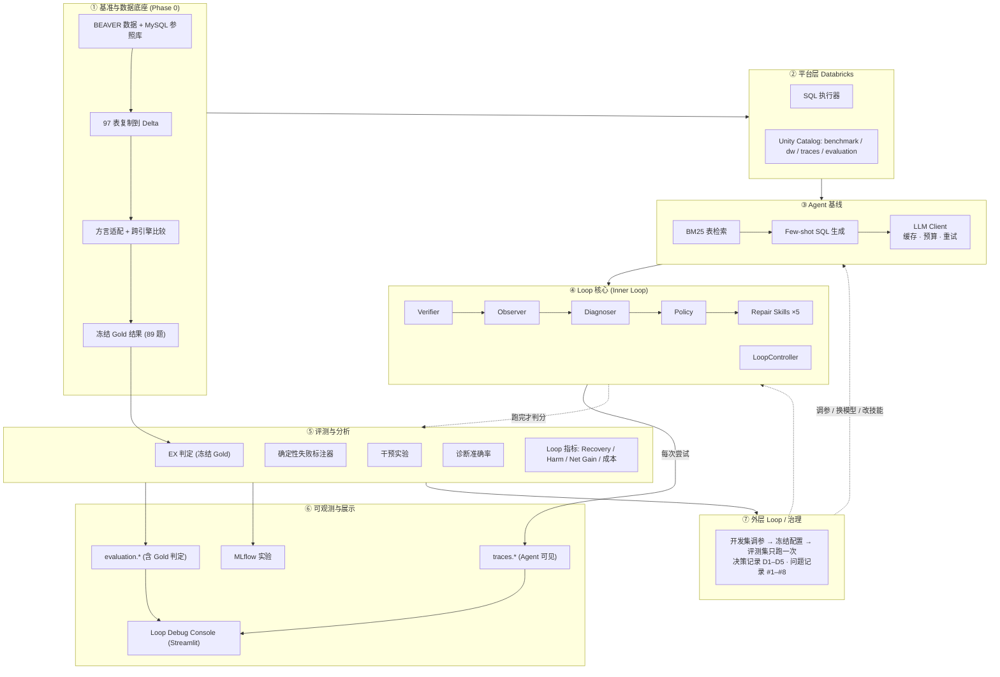
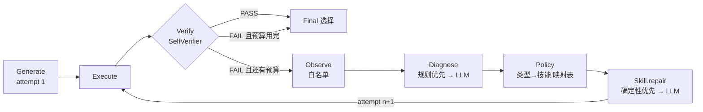

# 项目架构：自顶向下拆解

> 本文按"整体 → 分层 → 模块"的顺序，讲清项目由哪几部分组成、每部分怎么实现、有什么价值、面试时讲什么。
> Loop 的逐步执行过程见 [LOOP_WALKTHROUGH.md](LOOP_WALKTHROUGH.md)；设计取舍见 [LOOP_DESIGN.md](LOOP_DESIGN.md)。
> 文中所有数字都来自 [EXECUTION_LOG.md](EXECUTION_LOG.md) 和 `runs/` 下的真实运行结果。

---

## 1. 一句话定位

**一个能"自己发现错误、判断错在哪、选对工具修复、并用数据证明修复是否有效"的 Text-to-SQL Agent。**
Text-to-SQL 只是载体，核心是 **Loop Engineering**：把"生成 → 执行 → 校验 → 诊断 → 修复"做成一个可观测、可评测、可消融的工程闭环。

- 基准：BEAVER（企业数据仓库题，dw 库 97 张表、5,787 题；官方样本 100 题 → 可用 89 题）
- 平台：Databricks（Unity Catalog + SQL Warehouse + Delta + MLflow）
- 模型：智谱 `glm-4-flash`（免费、贪心解码，决策 D3/D4：先跑通全流程再换模型）

---

## 2. 总体架构图



纯文本版（适合白板手画）：

```
┌──────────────────────────────────────────────────────────────┐
│ ⑦ 外层 Loop / 治理   开发集调参 → 冻结 → 评测集跑一次 → 决策记录 │
├──────────────────────────────────────────────────────────────┤
│ ⑥ 可观测与展示       traces.* │ evaluation.* │ MLflow │ Console   │
├──────────────────────────────────────────────────────────────┤
│ ⑤ 评测与分析         EX │ 失败标注 │ 干预实验 │ 诊断准确率 │ Loop 指标 │
├──────────────────────────────────────────────────────────────┤
│ ④ Loop 核心          Verify → Observe → Diagnose → Policy → Skill │
│                      （LoopController 驱动，最多 2 次尝试）          │
├──────────────────────────────────────────────────────────────┤
│ ③ Agent 基线         BM25 检索 → Few-shot 生成 → LLM Client       │
├──────────────────────────────────────────────────────────────┤
│ ② 平台层             Databricks SQL Warehouse │ Unity Catalog │ Delta │
├──────────────────────────────────────────────────────────────┤
│ ① 基准与数据底座     BEAVER → MySQL 参照 → 复制 → 适配 → 冻结 Gold  │
└──────────────────────────────────────────────────────────────┘
  横切关注点：Gold 隔离 · 可复现 · 成本控制 · 安全（密钥不入库）
```

**依赖方向只能自下而上**：上层调用下层，下层不知道上层存在。唯一的"反向"箭头是外层 Loop 根据评测结果去改 ③④ 的配置，这一步刻意保留为人工决策（见第 9 节）。

---

## 3. 目录与层的对应

| 层 | 目录 | 对应阶段 |
|---|---|---|
| ① 基准与数据底座 | `benchmark/beaver/`、`scripts/phase0.py`、`scripts/fetch_beaver_db.py`、`config/phase0.yaml` | Phase 0 |
| ② 平台层 | `execution/`、`dbx/` | Phase 0 起贯穿 |
| ③ Agent 基线 | `agent/`、`scripts/phase1.py`、`config/phase1.yaml` | Phase 1 |
| ④ Loop 核心 | `loop_engineer/`、`skills/`、`scripts/phase4.py`–`phase6.py` | Phase 4–6 |
| ⑤ 评测与分析 | `evaluation/`、`benchmark/beaver/evaluator.py`、`benchmark/beaver/subtasks.py`、`scripts/phase3.py` | Phase 1/3/4/6 |
| ⑥ 可观测与展示 | `dbx/publish.py`、`dbx/tables.py`、`scripts/publish_run.py`、`app/` | Phase 1 起、Phase 9 |
| ⑦ 外层 Loop / 治理 | `docs/`（ROADMAP、EXECUTION_LOG、决策 D1–D5） | 全程 |
| 测试 | `tests/`（127 个） | 全程 |

---

## 4. ① 基准与数据底座（Phase 0）

### 实现

| 步骤 | 做什么 | 代码 |
|---|---|---|
| 取数 | 学员自己申请 HF 门控数据集，下载题目和 `beaver_db.zip`（MySQL dump） | `scripts/fetch_beaver_db.py`、`benchmark/beaver/loader.py` |
| 参照库 | 本地 MySQL 8.0 还原 dump，作为 BEAVER 官方口径的"标准答案机" | `execution/mysql.py` |
| 复制 | 97 张表从 MySQL 复制到 Databricks Delta（`self_healing_text2sql.dw`），逐表校验行数 | `benchmark/beaver/replicate.py` |
| 兼容性 | 每道题的 Gold SQL 在两个引擎上各跑一次，比较结果 | `benchmark/beaver/compatibility.py`、`benchmark/beaver/phase0.py` |
| 适配 | 两条有记录、经结果验证的方言规则：`VARIANCE/STD/STDDEV → VAR_POP/STDDEV_POP`；非聚合窗口函数去掉 frame 子句。**Gold SQL 原文不改**，改写版本单独存放 | `benchmark/beaver/adapter.py` |
| 比较 | `cross_engine_v2`：DECIMAL 按自身精度比较，浮点相对误差 1e-6，大结果集用分桶匹配 | `benchmark/beaver/evaluator.py:134` `cross_engine_match` |
| 冻结 | 通过的题把 Gold 结果写入 `benchmark.gold_results`，之后评测只读这张表 | `dbx/tables.py:83` `GOLD_RESULTS` |

结果：严格比较只有 37/100 一致 → 分析出三类根因（总体方差和样本方差、小数精度、窗口 frame）→ 适配后 **89 道 PRIMARY 题**（原样通过 46 + 规则适配 43）。

### 价值
- 解决"换了执行引擎，标准答案还对不对"的问题。没有这一步，后面所有准确率都没有可信度。
- 冻结 Gold 后，每次评测不再依赖 MySQL，结果可复现，也不会因为重算 Gold 而悄悄变化。

### 面试重点
1. **先证明基准可用，再做 Agent**："我第一步没写 Agent，而是先证明 BEAVER 搬到 Databricks 后答案还成立。严格比只有 37% 一致，逐条查出三类方言差异，用两条规则补回，最后 89 道可用。"
2. **不改 Gold，只加适配层**：适配规则是文档化、可审计、经结果验证的，原始 SQL 永远不动。这是评测诚信问题。
3. **比较规则要写死**：按答案（结果集）比，不按 SQL 文本比；列顺序算数；跨引擎只放宽数值表示差异。

---

## 5. ② 平台层（Databricks）

### 实现

| 组件 | 做什么 | 代码 |
|---|---|---|
| SQL 执行器 | 连 SQL Warehouse；只允许单条只读语句；统一会话设置（ANSI 关、超时 120s、关结果缓存）；超大结果返回 `TOO_MANY_ROWS`；报错时抽出错误类别 | `execution/databricks_sql.py:106` `execute` |
| 统一结果对象 | `ExecutionResult(status, rows, columns, error, error_class, elapsed_ms)`，MySQL 和 Databricks 共用 | `execution/base.py` |
| Catalog 布局 | 一个 catalog `self_healing_text2sql`，5 个 schema：`benchmark`、`dw`、`traces`、`evaluation`、`experience` | `dbx/catalog.py` |
| 表结构 | 所有 Delta 表的 Arrow schema 集中定义 | `dbx/tables.py` |

```python
# execution/databricks_sql.py:112-130（节选）
if not is_read_only(sql, "mysql") and not is_read_only(sql, "databricks"):
    return ExecutionResult(self.engine, "REJECTED", error="not a single read-only statement")
...
if max_rows is not None and len(rows) > max_rows:
    return ExecutionResult(self.engine, "TOO_MANY_ROWS", ...)
...
except Exception as e:
    cls = extract_error_class(msg)          # 例如 UNRESOLVED_COLUMN.WITH_SUGGESTION
    status = "TIMEOUT" if timed_out else "ERROR"
```

### 价值
- **执行器就是 Loop 的"传感器"**：Databricks 报错信息结构化（错误类别 + 未解析的列 + "Did you mean" 候选），这是后面规则诊断能做到不调 LLM 的前提。
- `traces` 和 `evaluation` 物理分开，从存储层面保证"Agent 看得到的"和"判分用的"不混在一起。

### 面试重点
1. **错误信息是免费的诊断信号**：`[UNRESOLVED_COLUMN.WITH_SUGGESTION] ... ata.DEPARTMENT_CODE cannot be resolved. Did you mean [sd.DEPARTMENT_CODE ...]`，一条报错就给出了错误类型、出错位置和候选修复。
2. **安全护栏**：生成的 SQL 只能只读、单语句；有行数上限防止笛卡尔积打爆仓库。
3. **Schema 分层对应权限边界**：`traces.*` 永远不含 Gold 衍生字段。

---

## 6. ③ Agent 基线（Phase 1）

### 实现

| 组件 | 做什么 | 代码 |
|---|---|---|
| 表检索 | BM25，表名/列名/样例值分字段加权（3/2/1），取 k=20。k 在评测集以外的题上调 | `agent/retriever.py:147` `retrieve` |
| SQL 生成 | Few-shot（示例只取评测集以外的题），prompt `baseline-v2`，含 MySQL→Databricks 统计函数对照 | `agent/generator.py:130` `generate`、`agent/generator.py:98` `build_prompt` |
| LLM Client | 智谱 OpenAI 兼容接口；`do_sample=False`；可重试状态码指数退避；`UsageMeter` 限制调用次数和 token；`CachingChatClient` 按 (模型, 参数, system, prompt) 的 SHA-256 指纹缓存 | `agent/llm.py:106` `ZhipuChatClient`、`agent/llm.py:171` `CachingChatClient` |
| SQL 分析 | sqlglot 解析 → 别名还原成真实表名、抽取列/关联/运算 | `agent/sql_analysis.py:93` `alias_map` |
| Join 图 | 从 schema 推断可关联的键（同名 `_CODE/_KEY/_ID` 等列） | `agent/join_graph.py:29` `join_candidates` |

基线规则：`setting=0`（不给任何标注）、一次生成、不重试。

**真实结果**（评测集 89 题，只跑一次）：首次准确率 **2/89 = 2.25%**，可执行 21/89；68 题报错，其中 `UNRESOLVED_COLUMN` 58 题。开发集 30 题：0/30，**21 个列报错中 20 个，这个列其实就在另一张已选中的表里**，是把列挂到了错误的别名上。

### 价值
- 提供"修复前"的对照组，所有 Loop 指标都相对它计算。
- 报错分布直接指出了 Loop 应该优先做什么（列挂错表 → `SchemaSearch`）。

### 面试重点
1. **基线要"老实"**：不给提示、不重试、一次出结果，否则 Loop 的提升说不清。
2. **缓存 + 贪心解码 = 可复现**：同一 prompt 永远拿到同一回答；多个实验组的第 1 次尝试完全相同（直接重放缓存），对比才公平，也省钱。
3. **数据驱动定方向**：不是凭感觉设计技能，而是先看基线的错误分布。

---

## 7. ④ Loop 核心（Phase 4–6）——项目重点

### 7.1 结构



| 模块 | 输入 → 输出 | 关键设计 | 代码 |
|---|---|---|---|
| **LoopController** | `AgentTask` → `LoopResult(attempts, rows, final_index)` | 两个实验组（targeted / generic）共用一个控制器，只有"如何产生下一次尝试"不同；预算 = 最多 2 次 SQL 尝试 | `loop_engineer/controller.py:95` `run` |
| **Verifier** | attempt + rows → `VerifierDecision(passed, mode, signals)` | 主实验只用 **SelfVerifier**（无 Gold 信号：没 SQL / 报错 / 结果过大 / 空结果 / 整列 NULL）；OracleVerifier 只做上界，泄露 1 bit Gold，结果单独标注 | `loop_engineer/verifier.py:25` |
| **Observer** | attempt 记录 → `Observation` | **白名单**只放 10 个字段；从报错文本解析出错误类别、未解析列、候选列、缺失表 | `loop_engineer/observer.py:46` `observe` |
| **Diagnoser** | Observation + schema → `Diagnosis(failure_type, confidence, reason, source, repair_hints)` | 有报错走规则（在 schema 里定位这个列：错别名 / 表已检索未使用 / 没检索到 / 凭空编造）；没有报错才调 LLM；`repair_hints` 把证据传给技能 | `loop_engineer/diagnose.py:70` `diagnose_by_rules`、`:165` `diagnose` |
| **Policy** | Diagnosis → `Route(skill, fallback, reason)` | 映射是**数据**不是代码，消融只需换表或禁用技能 | `loop_engineer/policy.py:27` `TARGETED`、`:52` `route` |
| **Repair Skills** | Observation + Diagnosis + `RepairContext` → `RepairResult` | 统一接口；能确定性修的不调 LLM；需要 LLM 时共用 `REPAIR_TEMPLATE`，只替换 instruction 和 schema 范围 | `skills/base.py:44` `RepairSkill`、`:50` `REPAIR_TEMPLATE` |

5 个技能 + 1 个占位：

| 失败类型 | 技能 | 做法 | 代码 |
|---|---|---|---|
| COLUMN_MAPPING | `SchemaSearch` | 先用 sqlglot 按作用域把每个挂错别名的列改到唯一拥有它的表（确定性）；有 join 自等式守卫；剩下的交给 LLM | `skills/schema_search.py:39` `fix_column_refs` |
| TABLE_RETRIEVAL | `RetrieveAgain` | 把真正拥有该列的表加进 schema，附上推断出的关联键 | `skills/retrieve_again.py:22` |
| JOIN_KEY | `FindJoinPath` | 给出当前用到的表之间的候选关联键 | `skills/find_join_path.py:15` |
| QUERY_DECOMPOSITION / DOMAIN_KNOWLEDGE | `ReplanQuery` | 要求先拆子问题再写 CTE | `skills/replan_query.py:20` |
| EXECUTION / UNKNOWN | `RepairSQL` | 按错误类别附 Databricks 语法注意事项 | `skills/repair_sql.py:19` |
| （预留）DOMAIN_KNOWLEDGE | `RetrieveKnowledge` | 占位：需要不含 Gold 的知识源 | `skills/retrieve_knowledge.py:15` |

### 7.2 价值
- 把"自我修复"从一句 prompt（"请检查并修正"）拆成 **可单独评测、可单独替换** 的 5 个环节：触发 / 观察 / 诊断 / 路由 / 修复。
- 每个环节都有自己的指标：Verifier 用混淆矩阵，Diagnoser 用诊断准确率，Skill 用单技能执行率和恢复率，整体用 Recovery / Harm / Net Gain。

### 7.3 真实结果（开发集 30 题，glm-4-flash，每组最多 2 次尝试）

| 实验组 | 可执行（首次 → 最终） | 答对（首次 → 最终） | 额外 token |
|---|---|---|---|
| Targeted + Self | 4 → **9** | 0 → 0 | 369,635 |
| Generic + Self | 4 → 6 | 0 → 0 | 361,964 |
| Targeted + Oracle（上界） | 4 → 9 | 0 → 0 | 412,048 |
| Generic + Oracle（上界） | 4 → 6 | 0 → 0 | 401,656 |

- 在**相同预算、几乎相同 token** 下，定向修复让可执行数比通用重试多 50%（9 vs 6）。
- 答对数都是 0：干预实验已证明这个模型即使拿到 5 类 Gold 提示也修不好（0/30），这是决策 D4 预见的结果。**这一轮数据只证明流程通，不作为效果结论。**
- 规则诊断在评测集上宽松准确率 **76.5%**（68 题），LLM 诊断在这个模型上基本无效（严格 0/19）。

### 7.4 面试重点
1. **为什么不是一句"请自我修正"**：通用重试不知道错在哪，只能让模型重猜；定向修复把错误信号变成结构化证据，再选工具。数据：可执行 9 vs 6。
2. **规则优先、LLM 兜底**：报错里已经有答案的就不花 token；76.5% vs LLM 0/19 说明这不是偷懒，而是更准。
3. **确定性修复优先**：`SchemaSearch` 能用 schema 查表解决的就不调 LLM；踩过坑（join 条件被改成 `sd.X = sd.X` 自等式，能跑但语义错），加了守卫，Phase 5 的虚高数字 4→10 被修正为 4→8。**主动发现并修正自己的虚高结果是很好的面试故事。**
4. **Self vs Oracle**：业界很多"自我修正"论文用 Gold 判断是否该修，等于偷看答案；本项目主实验只用生产环境拿得到的信号，Oracle 只作上界。
5. **Policy 是数据**：一行 `--disable SchemaSearch` 就能做消融，不改代码。

---

## 8. ⑤ 评测与分析

### 实现

| 组件 | 做什么 | 代码 |
|---|---|---|
| EX 判定 | 对比冻结 Gold 结果（官方口径：行的字符串集合，列顺序算数；跨引擎数值容差） | `benchmark/beaver/evaluator.py:40` `official_match`、`evaluation/baseline.py:48` `gold_judge` |
| 开发集 | 评测集以外 30 题，种子 20260926，Gold 在 MySQL 上实时算；所有调参只在这里做（D2） | `evaluation/devset.py` |
| 失败标注器 | 把生成 SQL 和 Gold SQL 都解析成语法树，逐项对比表/列/关联/常量/运算，给出主因 + 多标签。参照 = 标注 ∩ Gold SQL（标注多列了表的题占 18%） | `benchmark/beaver/subtasks.py` |
| 干预实验 | 每次只补一类 Gold 提示，看能否修好，用来找因果（仅离线分析） | `evaluation/intervention.py:86` |
| 诊断准确率 | Diagnoser 的输出对比标注器标签，分严格/宽松、规则级/LLM 级 | `evaluation/diagnosis_eval.py:18` `score` |
| Loop 指标 | 循环跑完之后才判分：Recovery Rate、Harm Rate、Net Gain、Verifier 混淆矩阵、单技能统计、成本 | `evaluation/loop_run.py:35` `run_arm`、`:67` `summarize` |

### 价值
- **先判断"能不能修"，再判断"修得好不好"**：干预实验得出"瓶颈在模型能力而不是信息"，避免在错误方向上继续堆技能。
- Harm Rate 专门衡量"把原本对的改错了"，这是自我修正系统最容易忽略的风险。

### 面试重点
1. **判分和循环严格分离**：Loop 运行时看不到对错；跑完才用 Gold 判分（`loop_run.py:45-48`）。
2. **开发集 / 评测集纪律**：评测集只在配置冻结后跑一次，防止在考题上调参。
3. **干预实验的结论**：5 类 Gold 提示全给也是 0/30 → 换更强模型是下一步最有价值的动作，而不是再加技能。
4. **根因 vs 直接原因**：诊断最大的混淆"选表 → 列映射"（31 题）——报错只看到"列挂错别名"，但更深层是"少用了一张表"。能说清这一点说明真的看过数据。

---

## 9. ⑥ 可观测与展示

### 实现

| 组件 | 做什么 | 代码 |
|---|---|---|
| 本地运行目录 | 每次运行一个目录：`run_meta.json`、`results.jsonl`（每题所有尝试）、`summary.json` | `evaluation/loop_run.py:37-63` |
| Trace 表 | 每次尝试一行：检索、SQL、执行状态、verifier 决定和信号、诊断类型/置信度/理由、修复技能/理由、token、延迟 | `dbx/tables.py:53` `EXECUTION_TRACES`、`dbx/publish.py:35` `flatten_loop_records` |
| 评测表 | `evaluation.evaluation_results`（对错）、`evaluation.runs`（汇总）、`failure_labels`、`diagnosis_eval` | `dbx/tables.py:69`、`:76` |
| MLflow | 每个 run 记录参数（模型、prompt 版本、策略、verifier）和指标 | `dbx/publish.py:111-150` |
| Loop Debug Console | Streamlit：实验组对比、单题逐次尝试回放、诊断分布、技能统计；为 Phase 7/8 预留区块 | `app/dashboard.py`、`app/data.py` |

### 价值
- 每一次修复都能回答"为什么修、修了什么、修完怎样"，可以逐题复盘。
- 看板直接读 Delta 表，新的运行发布后自动出现。

### 面试重点
1. **Trace 是 Loop 的调试器**：没有逐次尝试的 trace，Loop 出问题只能猜。dw_4188 的自等式 bug 就是在 trace 里看到"能执行但 join 没意义"才发现的。
2. **Trace 不含 Gold**：`traces.*` 可以给 Agent 回读（未来做经验库 `experience` schema），`evaluation.*` 只给人看。

---

## 10. ⑦ 外层 Loop / 治理

内层 Loop 修的是**单道题**；外层 Loop 修的是**系统本身**（prompt、模型、技能、策略）。

```
开发集跑实验 → 看指标和 trace → 找出最大的失败类别 → 改配置/技能 → 开发集再跑
                                                  ↓（满意后冻结）
                                         评测集只跑一次 → 写入 EXECUTION_LOG
```

本项目里外层 Loop 是**人工 + 文档化**执行的：每一个改动都记在 `docs/EXECUTION_LOG.md` 的决策表（D1–D5）和问题表（#1–#8）里，写明依据的数据。

| 例子 | 触发的数据 | 做的改动 |
|---|---|---|
| D2 | 26/89 题干含 MySQL 函数名，和 prompt 规则冲突 | prompt 升级 `baseline-v2`，建立开发集 |
| Phase 5 v2 | 引擎只报第一个错列，修一个下一个又报错 | `SchemaSearch` 改为一次修所有列 |
| 问题 #8 | trace 中出现 `sd.X = sd.X` | 加 join 自等式守卫，重跑并归档旧结果 |
| D4 | 干预实验 0/30 | 确认瓶颈在模型，保留模型先跑通流程 |

### 面试重点
- **内层 vs 外层**：内层是运行时自动的（每题最多 2 次）；外层是研发流程，自动化外层（自动调 prompt）风险是过拟合开发集，所以保留人工决策 + 冻结评测。
- **能讲出每个决策背后的数字**，比讲框架更有说服力。

---

## 11. 横切关注点

| 关注点 | 怎么保证 | 在哪里 |
|---|---|---|
| **Gold 隔离** | Agent 只拿 `AgentTask(case_id, question, db)`；Observer 白名单；技能不许 import `benchmark`/`evaluation`（测试强制）；`oracle_hints` 只在干预实验用 | `benchmark/beaver/dataset.py:75` `agent_view`、`loop_engineer/observer.py:16`、`tests/test_phase5.py:139` |
| **可复现** | 贪心解码 + prompt 指纹缓存；固定种子（样本 77、开发集 20260926）；run_meta 记录模型/prompt/诊断器版本 | `agent/llm.py:164`、`scripts/phase6.py:99-102` |
| **成本控制** | `UsageMeter` 限调用次数和 token；缓存重放共享的第 1 次尝试；规则诊断不花 token；报告里有"每净恢复一题的额外 token" | `agent/llm.py:60`、`evaluation/loop_run.py:101` |
| **公平对比** | 两组共用控制器、verifier、预算；第 1 次尝试完全一致 | `loop_engineer/controller.py:1-17` |
| **安全** | 只读单语句；结果行数上限；`.env` 和 BEAVER 数据不入库；提交前扫描密钥 | `execution/databricks_sql.py:112`、`.gitignore` |
| **测试** | 127 个单元测试，覆盖适配、比较、诊断规则、技能、控制器、Gold 隔离 | `tests/` |

---

## 12. 面试 3 分钟讲法（按架构顺序）

1. **问题**（15 秒）：企业数仓的 Text-to-SQL 首次准确率很低（本项目基线 2.25%），需要能自己发现并修复错误的 Agent，而且要能证明修复有效。
2. **基准**（30 秒）：BEAVER 迁到 Databricks，先证明答案还成立：37% → 89 题可用，Gold 冻结不改。
3. **基线**（30 秒）：BM25 + few-shot，不给提示、不重试。报错里 58/68 是列挂错表 → 决定 Loop 的第一优先级。
4. **Loop**（60 秒）：Verify → Observe → Diagnose → Policy → Skill。无 Gold 触发，规则优先诊断（76.5%），确定性优先修复，策略是数据可消融。同预算下可执行 9 vs 6。
5. **评测诚信**（30 秒）：Self vs Oracle、Harm Rate、开发/评测集分离、主动修正自己虚高的 4→10 为 4→8。
6. **结论与下一步**（15 秒）：干预实验证明瓶颈是模型能力，下一步换模型在同一套流程上重跑，流程和指标都已就绪。
