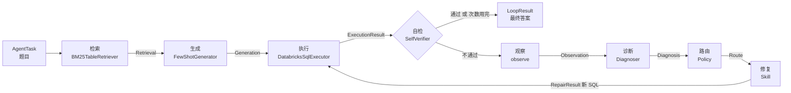
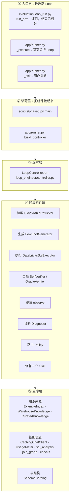
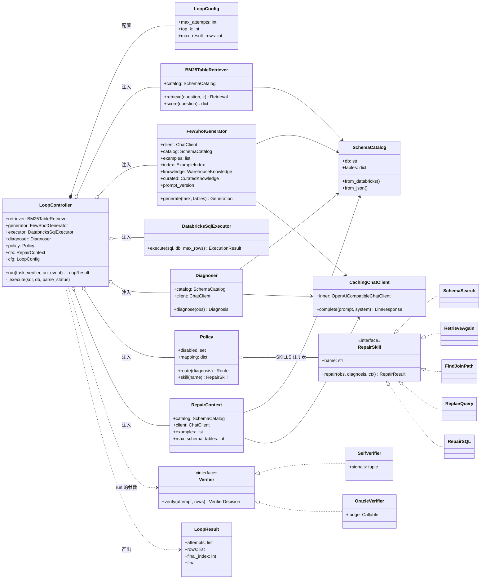
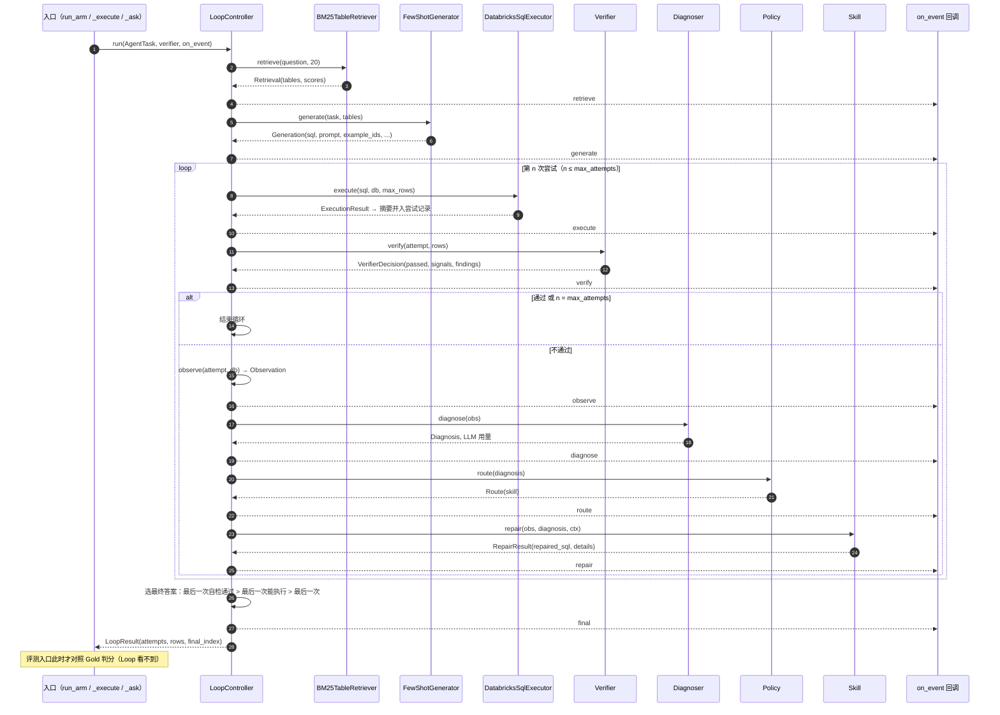
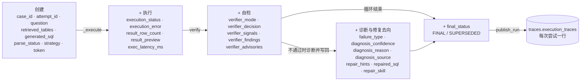

# Loop 架构：模块、类关系与数据流

> 给第一次接触本项目的人：读完这一篇，应能说清 **Loop 由哪些模块组成、各个类之间是什么关系、一道题的数据怎么流动**。
> 设计理由见 [LOOP_DESIGN.md](LOOP_DESIGN.md)，按步骤对照源码讲解见 [LOOP_WALKTHROUGH.md](LOOP_WALKTHROUGH.md)，每次调用 LLM 时模型看到什么见 [CONTEXT_DESIGN.md](CONTEXT_DESIGN.md)。
> 图用 Mermaid 绘制，GitHub 和多数 Markdown 预览可直接渲染。代码引用以 `product-loop-review` 分支为准。

---

## 0. 一句话总览

**Loop = 一个编排器（`LoopController`）+ 八个阶段组件 + 一串只读数据对象。**

编排器按 "检索 → 生成 → 执行 → 自检 →（不通过）观察 → 诊断 → 路由 → 修复 → 再执行"的顺序调用各组件。每个组件只负责一步：接收上一步的数据对象，产出下一个数据对象。全程维护一份"尝试记录"字典，最后写进 trace。



---

## 1. 顶层架构：五层



| 层 | 职责 | 关键点 |
|---|---|---|
| ① 入口层 | 决定跑哪些题、用哪个自检器、事件发给谁、结束后做什么 | 评测入口在 Loop **结束后**才用 Gold 判分；提问入口没有 Gold |
| ② 装配层 | 创建所有组件，注入编排器 | 同一个 LLM 客户端被生成器、诊断器、修复上下文**共用**（共享缓存和预算） |
| ③ 编排层 | 控制顺序、终止条件、选最终答案、推送事件、拼装尝试记录 | 不包含任何具体的检索 / 诊断 / 修复逻辑 |
| ④ 阶段组件层 | 每个组件只做一步 | 组件之间不直接互相调用，只通过数据对象交接 |
| ⑤ 支撑层 | 被组件使用的知识、表结构和工具 | 知识来源只被生成器使用（见第 7 节） |

---

## 2. 类图



图例：`*--` 组合（编排器自带）；`o--` 聚合（从外部注入）；`<|..` 实现接口；`..>` 依赖（参数或产出）；`-->` 引用。

> `Verifier` 和 `RepairSkill` 是"约定的接口"：代码里 `RepairSkill` 是 `typing.Protocol`（[skills/base.py:47](../skills/base.py#L47)）；自检器没有显式接口类，两个实现都提供 `verify(attempt, rows)`，控制器只依赖这个方法。

### 2.1 各类方法的功能

| 类 | 方法 | 功能 |
|---|---|---|
| `LoopController` | `run(task, verifier, on_event)` | 编排一道题的完整闭环：检索 → 生成 → 循环（执行 → 自检 → 观察 → 诊断 → 路由 → 修复）→ 选出最终答案；逐步推送事件，返回 `LoopResult` |
| `LoopController` | `_execute(sql, db, parse_status)` | 执行一条 SQL，返回并入尝试记录的执行摘要（状态、报错、行数、前 5 行预览、耗时）和单独保存的完整结果行；没有 SQL 时不执行 |
| `LoopResult` | `final` | 返回被选为最终答案的那次尝试记录 |
| `SchemaCatalog` | `from_databricks()` / `from_json()` | 从 Databricks 元数据或已保存的 JSON 构建表结构目录（表名、列名、类型、样例值），供检索、生成、诊断、修复共用 |
| `BM25TableRetriever` | `score(question)` | 用 BM25 给每张表算出与问题的相关分数 |
| `BM25TableRetriever` | `retrieve(question, k)` | 按分数取前 k 张表（控制器传 20），返回候选表和分数 |
| `FewShotGenerator` | `generate(task, tables)` | 挑选示例、补充示例和审核知识里用到的表，拼出 prompt 调用 LLM，从回复中抽取第一版 SQL |
| `FewShotGenerator` | `prompt_version` | 返回当前 prompt 的版本号：基础版本（固定示例或相似题示例）加上 `+kb`（使用说明）、`+cur`（审核知识）后缀，写进运行元数据 |
| `DatabricksSqlExecutor` | `execute(sql, db, max_rows)` | 只读检查后在 Databricks 上执行 SQL；超过行数上限返回 `TOO_MANY_ROWS`，出错时提取错误类别 |
| `SelfVerifier` | `verify(attempt, rows)` | 不看 Gold，根据执行状态、SQL 结构和结果数值判断这次尝试是否可疑，返回是否通过、触发的信号和修复提示 |
| `OracleVerifier` | `verify(attempt, rows)` | 用 Gold 判断对错，只用于估算上界，结果单独标注 |
| `Diagnoser` | `diagnose(obs)` | 判断失败类型（选表、列映射、关联键、查询拆解、领域知识、执行错误），给出置信度、原因和修复线索；先用规则，规则没有结论才调 LLM |
| `Policy` | `route(diagnosis)` | 按"失败类型 → 技能"映射表选出技能名；被禁用的技能退回 RepairSQL，并标明是否为临时替代 |
| `Policy` | `skill(name)` | 按名字从注册表 `SKILLS` 取出技能对象 |
| `RepairSkill` | `repair(obs, diagnosis, ctx)` | 修复一类失败：先做不需要 LLM 的确定性工作，解决不了的部分再带定向指令调用一次 LLM，返回新 SQL 和修复过程 |
| `SchemaSearch` | `repair` | 修复列挂错表或别名：能唯一确定正确表的列直接改，撤回会让关联条件失效的改动，剩下的连同候选列、候选关联键交给 LLM |
| `RetrieveAgain` | `repair` | 修复少用了表或表不存在：把诊断找到的、包含该列的表和候选关联条件交给 LLM；表不存在时提供名字相近的真实表 |
| `FindJoinPath` | `repair` | 修复关联键错误：列出 SQL 已用各表之间共享的键列，要求逐条核对 JOIN ON |
| `ReplanQuery` | `repair` | 修复查询结构错误：让模型先拆子问题，每个写成一个 CTE，再逐项核对输出列、筛选、分组、排序 |
| `RepairSQL` | `repair` | 修复执行报错（也是兜底）：带上报错信息做最小改动，附上 Databricks 语法注意事项 |
| `RepairContext` | — | 不含方法，是技能共享的资源包：表结构目录、LLM 客户端、示例、修复 prompt 最多展示的表数 |
| `CachingChatClient` | `complete(prompt, system)` | 所有 LLM 调用的入口：按（模型, 参数, system, prompt）指纹查缓存，命中就重放，未命中才调用内层客户端（计入调用预算） |

图外还有两个函数也在 Loop 内部被调用：`observe(attempt, db)`（[observer.py:59](../loop_engineer/observer.py#L59)）按白名单从尝试记录中取字段，并从报错文本中解析出错误类别、找不到的列、候选列、不存在的表；`diagnose_by_rules(obs, catalog)`（[diagnose.py:83](../loop_engineer/diagnose.py#L83)）是诊断的规则部分，判断不了返回 `None`。

---

## 3. 类之间的关系

### 3.1 编排器和组件：依赖注入

`LoopController` 自己不创建任何组件，全部在构造时从外面传入（[controller.py:72](../loop_engineer/controller.py#L72)）。自检器更特殊：它不是字段，而是**每次调用 `run` 时传入**的参数。

| 关系 | 谁 → 谁 | 方式 | 带来的能力 |
|---|---|---|---|
| 注入 | 装配层 → 编排器 | 构造参数 | 同一个编排器能装配出不同配置（模型、示例方式、知识开关）；测试时可以换成假组件 |
| 参数传入 | 入口层 → 编排器 | `run(task, verifier, on_event)` | 同一个编排器可以按题换自检器（Self / Oracle），按调用方换事件接收者 |
| 实现接口 | 2 个自检器、5 个技能 | 相同方法签名 | 编排器和路由不关心具体实现 |
| 注册表 | `Policy` → 技能 | `SKILLS`：名字 → 实例（[policy.py:24](../loop_engineer/policy.py#L24)） | 路由规则只写名字，可替换、可禁用 |
| 共享资源 | 生成器、诊断器、修复上下文 → 同一个 LLM 客户端、同一份表结构 | 装配时传入同一个对象 | 共享缓存、共享预算；所有组件看到同一份 schema |

### 3.2 组件之间：只通过数据对象交接

组件之间**没有直接调用**。生成器不知道执行器的存在，诊断器不知道有哪些技能。所有交接都经过编排器，用只读的数据对象传递：

| 交接 | 上游产出 | 下游消费 |
|---|---|---|
| 检索 → 生成 | `Retrieval.tables` | `FewShotGenerator.generate(task, tables)` |
| 生成 → 执行 | `Generation.sql` | `executor.execute(sql, db)` |
| 执行 → 自检 | 尝试记录 + 完整结果行 | `verifier.verify(attempt, rows)` |
| 自检 → 观察 | 尝试记录（含自检字段） | `observe(attempt, db)`：只取白名单字段 |
| 观察 → 诊断 | `Observation` | `Diagnoser.diagnose(obs)` |
| 诊断 → 路由 | `Diagnosis.failure_type` | `Policy.route(diagnosis)` |
| 路由 → 修复 | `Route.skill` | `Policy.skill(name).repair(obs, diagnosis, ctx)` |
| 修复 → 执行 | `RepairResult.repaired_sql` | 作为下一次尝试，回到执行 |

### 3.3 共同依赖的支撑模块

| 支撑模块 | 被谁使用 | 用途 |
|---|---|---|
| `SchemaCatalog` | 检索、生成、诊断、修复 | 表结构：渲染 schema、查列属于哪张表、推断关联键 |
| `CachingChatClient` | 生成、诊断（LLM 级）、修复 | 调 LLM，带缓存和预算 |
| `checks.py` | 自检 | 结构检查、数值一致性检查 |
| `sql_analysis.alias_map` | 诊断、所有技能 | 解析 SQL 用到的表和别名 |
| `join_graph` | FindJoinPath、RetrieveAgain、SchemaSearch | 从 schema 推断可关联的键列 |
| `ExampleIndex` / `WarehouseKnowledge` / `CuratedKnowledge` | **只有生成器** | 外循环产出的经验知识 |

---

## 4. 时序：一道题的完整调用过程



---

## 5. 数据流

### 5.1 数据对象一览

| 数据对象 | 定义 | 产生者 | 消费者 | 关键字段 | 生命周期 |
|---|---|---|---|---|---|
| `AgentTask` | [dataset.py:30](../benchmark/beaver/dataset.py#L30) | 入口层 | 编排器 | `case_id`、`question`、`db` | 一道题 |
| `Retrieval` | [retriever.py:113](../agent/retriever.py#L113) | 检索 | 生成 | `tables`、`scores` | 一道题 |
| `Generation` | [generator.py:59](../agent/generator.py#L59) | 生成 | 编排器 | `sql`、`parse_status`、`llm`、`prompt`、`example_ids`、`schema_tables`、`notes` | 第 1 次尝试 |
| `ExecutionResult` | [execution/base.py:13](../execution/base.py#L13) | 执行 | 编排器（`_execute` 整理成摘要） | `status`、`rows`、`error`、`error_class`、`elapsed_ms` | 一次尝试 |
| `VerifierDecision` | [verifier.py:29](../loop_engineer/verifier.py#L29) | 自检 | 编排器 | `passed`、`signals`、`findings`、`advisories` | 一次尝试 |
| `Observation` | [observer.py:36](../loop_engineer/observer.py#L36) | 观察 | 诊断、修复 | 白名单字段 + `error_class`、`unresolved_column`、`suggestions`、`missing_table`、`verifier_findings` | 一次失败 |
| `Diagnosis` | [diagnose.py:64](../loop_engineer/diagnose.py#L64) | 诊断 | 路由、修复 | `failure_type`、`confidence`、`reason`、`source`、`repair_hints` | 一次失败 |
| `Route` | [policy.py:41](../loop_engineer/policy.py#L41) | 路由 | 编排器 | `skill`、`fallback`、`reason` | 一次失败 |
| `RepairResult` | [skills/base.py:31](../skills/base.py#L31) | 修复 | 编排器 | `repaired_sql`、`repair_action`、`tables`、`used_llm`、token、`details` | 下一次尝试 |
| **尝试记录**（dict） | 编排器内 | 编排器逐步写入 | 自检、观察、trace | 见 5.2 | 一次尝试 → trace 一行 |
| `LoopResult` | [controller.py:56](../loop_engineer/controller.py#L56) | 编排器 | 入口层 | `attempts`、`rows`、`final_index` | 一道题 |

所有数据对象（除尝试记录外）都是**只读的 dataclass**：每一步只产出新对象，不修改上游对象，排查时可以逐个检查。

### 5.2 尝试记录的生命周期



修复产生的下一条尝试记录，在创建时就带上 `repair_skill`、`repair_action`、`repair_reason`、`repair_fallback`、`used_llm`、`diag_tokens`、`tables`，记录"它是怎么来的"。

**对错不在尝试记录里**：评测入口在 Loop 结束后单独算出 `attempt_correct`，发布时写进 `evaluation.*`，与 trace 物理分离。

### 5.3 什么信息不会流进去

| 边界 | 机制 | 代码 |
|---|---|---|
| Gold 不进入 Loop | 入口只传 `AgentTask`（编号、问题、库名） | [dataset.py:30](../benchmark/beaver/dataset.py#L30) |
| Gold 派生字段不进入诊断 / 修复 | 观察只取 12 个白名单字段 | [observer.py:16](../loop_engineer/observer.py#L16) |
| 完整结果行不进入尝试记录 | `_execute` 只把摘要并入记录，完整行另存 `LoopResult.rows` | [controller.py:81](../loop_engineer/controller.py#L81) |
| 技能不能读评测代码 | 测试强制 `skills/`、`loop_engineer/` 不 import `benchmark` / `evaluation` | `tests/test_phase5.py` |

---

## 6. 装配：三个入口如何组装同一个 Loop

入口函数的功能：

| 函数 | 位置 | 功能 |
|---|---|---|
| `main` | [scripts/phase6.py:42](../scripts/phase6.py#L42) | 命令行评测入口：读参数和配置，组装控制器，调用 `run_arm` 跑一批题，结果写入运行目录 |
| `build_controller` | [app/runner.py:193](../app/runner.py#L193) | 按运行设置组装 `LoopController`：给 LLM 客户端加缓存，创建生成器，按开关加载使用说明和审核知识，注入其余组件；网页两个入口共用 |
| `_execute` | [app/runner.py:234](../app/runner.py#L234) | 网页"运行 Loop"的后台线程：设置调用预算，组装控制器，调用 `run_arm` 并把事件推给页面，结束后生成分析报告、按设置发布到 Delta |
| `_ask` | [app/runner.py:352](../app/runner.py#L352) | 网页"提问"的后台线程：组装控制器，用 `SelfVerifier` 对用户问题运行一次 Loop，取回最终 SQL 的结果，存进 `experience.user_queries` 等待用户反馈 |
| `run_arm` | [evaluation/loop_run.py:36](../evaluation/loop_run.py#L36) | 逐题运行 Loop：只把题面交给 Loop，Loop 返回后再用 Gold 判分，写逐题记录；全部跑完后汇总指标 |

| 入口 | 装配位置 | 自检器 | 事件接收者 | 结束后 |
|---|---|---|---|---|
| 命令行评测 | [scripts/phase6.py:105](../scripts/phase6.py#L105) | 按参数选 Self / Oracle | 无 | `run_arm` 判分、写运行目录 |
| 网页"运行 Loop" | [app/runner.py:193](../app/runner.py#L193) `build_controller` → [:234](../app/runner.py#L234) `_execute` | 可选 Self / Oracle | `LiveRun.push`（页面每秒刷新） | 判分、分析报告、发布 Delta |
| 网页"提问" | 同上 `build_controller` → [:352](../app/runner.py#L352) `_ask` | 只能 Self（没有 Gold） | `AskRun.push` | 存 `experience.user_queries`，等用户反馈 |

装配要点：

```python
client = CachingChatClient(inner, cache_path)              # 一个 LLM 客户端
generator = FewShotGenerator(client, catalog, examples, index=..., knowledge=...)
attach_curated(generator, load_curated(conn, layout))      # 只有网页端加载审核知识
controller = LoopController(
    BM25TableRetriever(catalog), generator, conn,          # 检索器、生成器、执行器
    Diagnoser(catalog, client), Policy(),                  # 诊断器、路由（同一个 client）
    RepairContext(catalog, client, examples),              # 修复上下文（同一个 client）
    LoopConfig(strategy, max_attempts=max_repairs + 1, top_k=20, max_result_rows=500_000))
result = controller.run(task, SelfVerifier(), on_event=...)
```

外循环（`scripts/outer_loop.py`）**不使用编排器**：它只调用检索器和生成器做第 1 次生成，再对照 Gold 判分，因为它衡量的是"生成端知道什么"。

---

## 7. 架构上的特点与已知问题

**特点**
1. **编排与能力分离**：编排器只管顺序和终止，具体能力都在组件里；换组件不用改编排器。
2. **依赖注入 + 接口**：同一套代码可以切换自检器（Self / Oracle 上界）、示例方式和知识开关，测试时也能换成假组件。
3. **数据对象只读、单向流动**：每一步的输入输出清楚，网页时间线就是按这些对象逐步展示的。
4. **路由是数据**：消融实验换映射表或禁用技能，不改代码。

**已知问题**（详见 [CONTEXT_DESIGN.md](CONTEXT_DESIGN.md) 第 8、9 节）

| 问题 | 说明 | 方向 |
|---|---|---|
| 尝试记录是松散字典 | 字段分散在编排器各处写入，没有统一定义，写错字段名不会报错 | 改为 `Attempt` 数据类 |
| 生成和修复不对称 | 第 1 次走生成器（有经验知识），之后走技能（没有） | 统一为"产生一条 SQL"的接口，修复复用经验知识 |
| `run` 偏长 | 编排、事件、记录拼装都在一个函数里 | 拆出"一次尝试"的子函数 |
| 检索器没有接口 | 直接依赖 `BM25TableRetriever` 类型 | 定义 `Retriever` 协议，便于换向量检索 |
| 命令行不加载审核知识 | 只有网页端 `build_controller` 调用 `attach_curated` | `phase6.py` 增加 `--curated` |

---

## 8. 推荐的阅读顺序

1. [loop_engineer/controller.py](../loop_engineer/controller.py) 的 `run`（[:107](../loop_engineer/controller.py#L107)）：先看主线，约 100 行；
2. 各数据对象的定义（第 5.1 节表格里的链接）：知道每一步交接什么；
3. 按时序依次看组件：`retriever.py` → `generator.py` → `verifier.py` / `checks.py` → `observer.py` → `diagnose.py` → `policy.py` → `skills/`；
4. 装配：[app/runner.py:193](../app/runner.py#L193) `build_controller`；
5. 评测入口：[evaluation/loop_run.py:36](../evaluation/loop_run.py#L36) `run_arm`，看 Loop 结束后如何判分。
